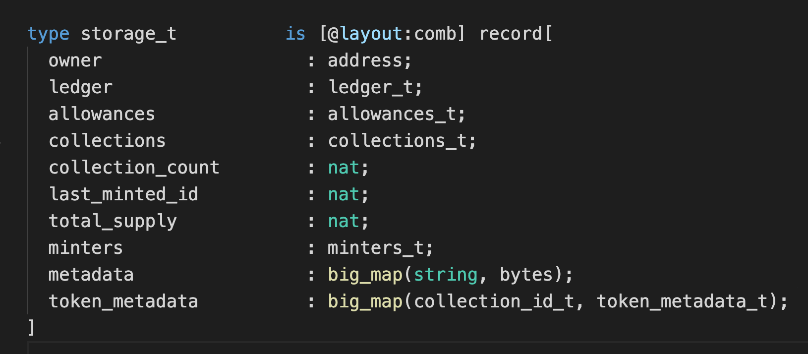

# QUIPU Tokenomics

**Token Details:**

Token name and symbol: QUIPU&#x20;

Contract address: KT193D4vozYnhGJQVtw7CoxxqphqUEEwK6Vb&#x20;

Type: FA2&#x20;

Total supply: 10 000 000&#x20;

Decimals: 6

**Initial distribution:**

So far we have conducted two QUIPU airdrops as a thank you to our long-time users. A modest amount of tokens is reserved for future community rewards.

Circulated tokens after the second airdrop: 845 070 QUIPU&#x20;

Circulated supply after the second airdrop is 8.4% (6% airdrops, 2.4% other funds)

**Token distribution model:**

**Token use cases:**

QUIPU tokens will be used in [QuipuSwap governance](https://github.com/madfish-solutions/quipuswap-governance) and as a means of payment for future additional QuipuSwap services.

More details about QuipuSwap tokenomics you may [find in this article](https://story.madfish.solutions/quipuswap-tokenomics-guide-quipu-learn-everything-about-our-governance-token/).
